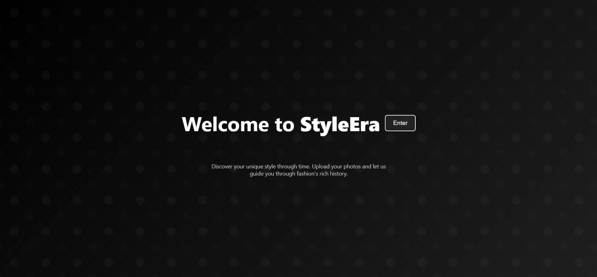
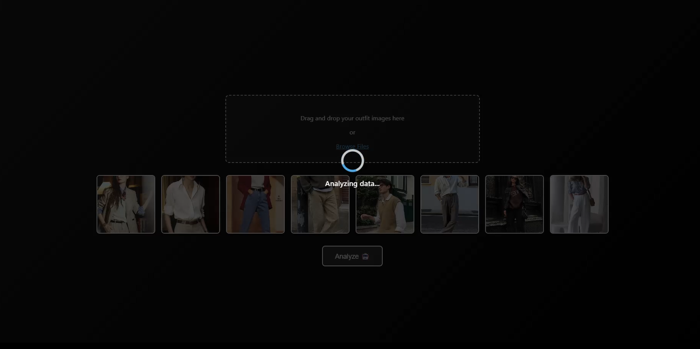
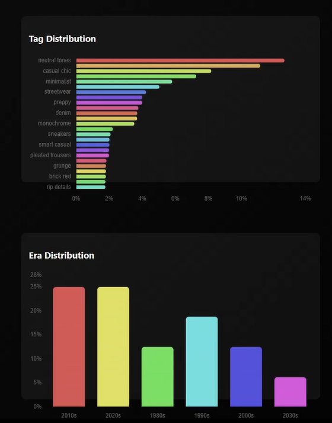
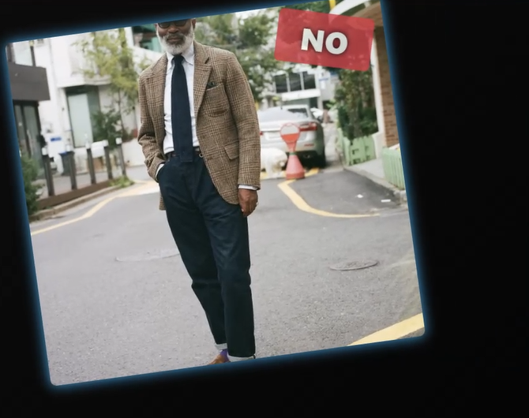
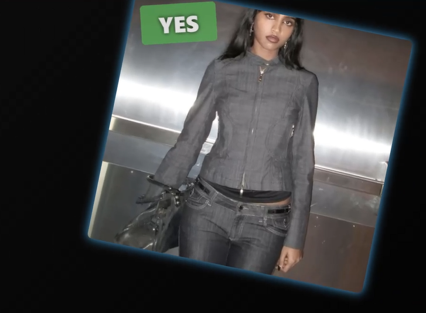
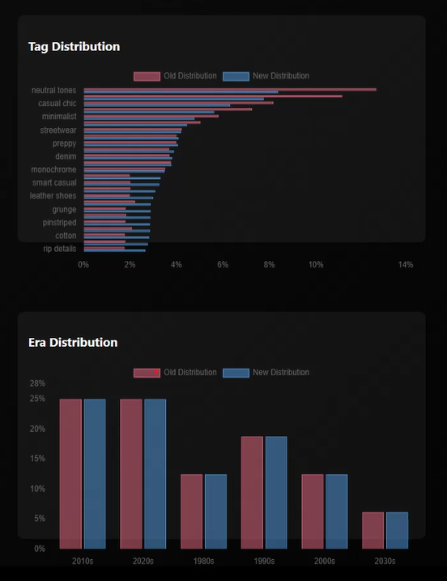
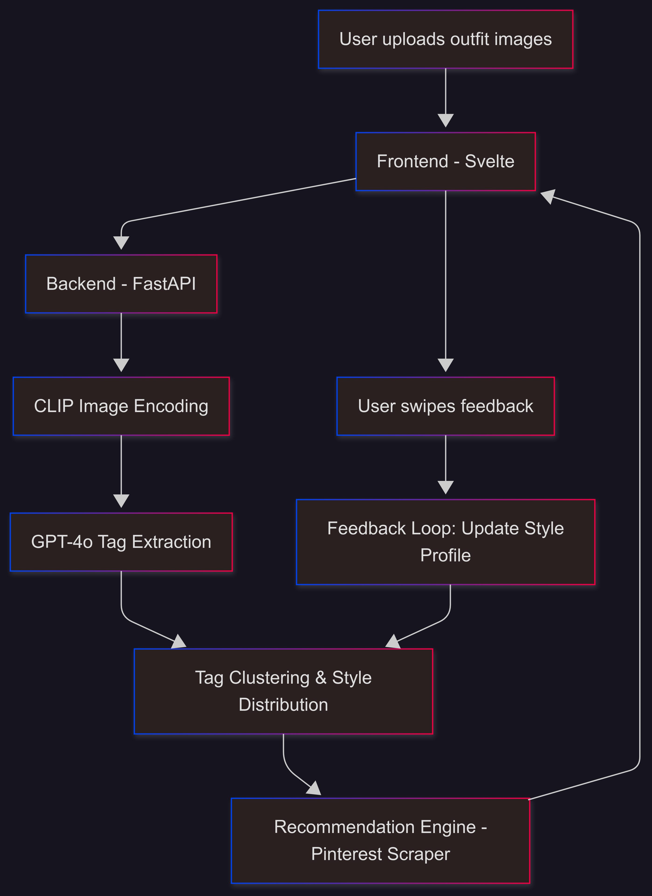

# 👗 StyleEra

StyleEra is an AI-powered fashion stylist that analyzes outfit photos, identifies their aesthetic, and recommends era-inspired looks — all through a dynamic Tinder-like interface. It combines **CLIP image embeddings**, **LLM-driven tag generation**, and **semantic search on Pinterest** to deliver personal fashion recommendations.


---

## ✨ Features

- 🖼️ Upload 1–10 outfit images to extract fashion tags and predict era ranges (e.g. “1990s”).
- 🧠 Uses GPT-4o for structured tag extraction with confidence scores.
- 🧷 Clusters similar tags using LLMs for a cleaner taxonomy.
- 📊 Visualizes your fashion “persona” via tag and era distributions.
- ❤️ Swipe-style feedback loop updates your style profile in real-time.
- 🔍 Recommends aesthetic-matched looks scraped from Pinterest.

---

## 📸 Screenshots


### 🏠 Landing Page
Simple and clean UI welcoming users to StyleEra.<br>


### 🔍 Image Analysis in Progress
Displays upload preview and backend progress as images are processed.<br>


### 📊 Style Distribution
Bar chart of the current dominant style tags and eras detected from uploaded outfits.<br>
<div style="text-align:center;">
  
</div>

### ❤️ Swipe Interface
Interactive Tinder-like interface for feedback:<br>
- Swipe <b>right</b> to accept suggested looks<br>
- Swipe <b>left</b> to reject them
<div style="display:flex; gap:10px; justify-content:center;">
  
  
</div>

### 🔄 Updated Distribution
After swiping, see how your style distribution evolved based on your likes/dislikes.<br>
<div style="text-align:center;">
  
</div>


---

## 🧠 How It Works

1. **Upload Images**  
   Users upload outfit images via the frontend.

2. **Backend Analysis (`/get_analysis`)**  
   - Images are encoded with CLIP.
   - GPT-4o (via Azure OpenAI) analyzes style, material, and aesthetic tags.
   - Tag fusion is done to cluster semantically similar tags.
   - A distribution of styles and eras is computed.

3. **Style Sampling (`/generate_searches`)**  
   - Tags are sampled based on their distribution weights.
   - The most likely era is selected.

4. **Recommendation Engine (`/get_recommendations`)**  
   - Pinterest is scraped with sampled tags + era to return real-world inspiration.

5. **Feedback Loop (`/update_distribution`)**  
   - Swipe actions retrain the user distribution by comparing image embeddings to tag vectors.

---

## 🛠️ Tech Stack

- **Backend**: FastAPI, PyTorch, OpenAI GPT-4o, CLIP
- **Frontend**: Svelte
- **Search**: Pinterest scraping via Selenium
- **Infra**: Docker-ready, Azure OpenAI integration

---

## 🧩 Architecture Overview

Visual overview of StyleEra’s flow from image upload to personalized recommendations.

<div style="text-align:center;">
  
</div>

---

## ⚙️ Setup Instructions

### 🔑 Environment Variables

Create a `.env` file with:

```env
AZURE_OPENAI_API_KEY=your-key
AZURE_OPENAI_ENDPOINT=https://your-endpoint.openai.azure.com/
AZURE_OPENAI_DEPLOYMENT_NAME=your-deployment-name
